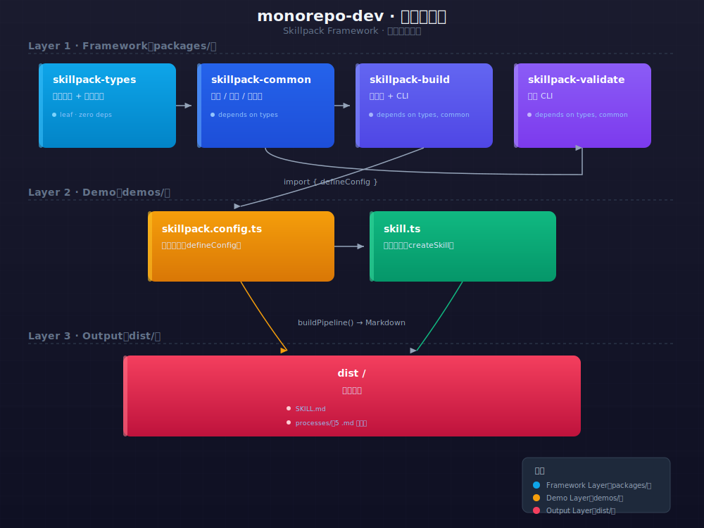
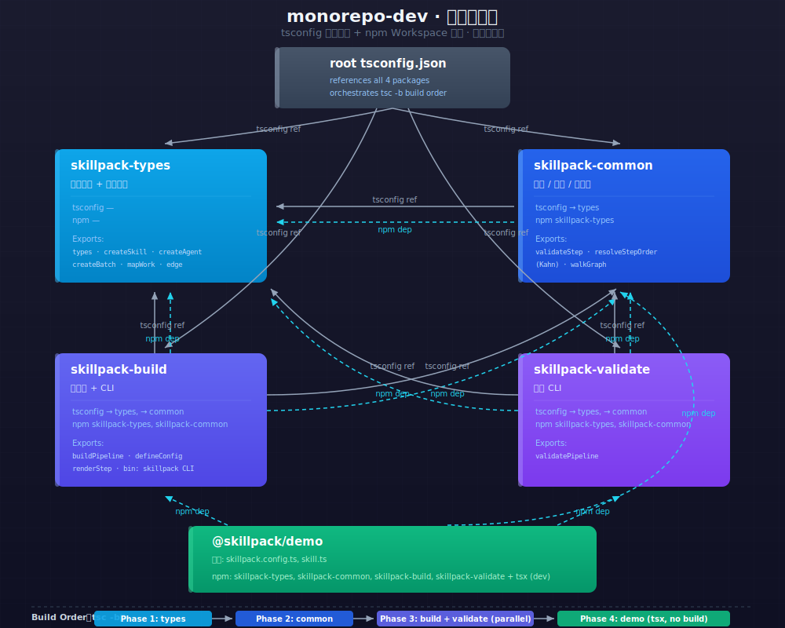
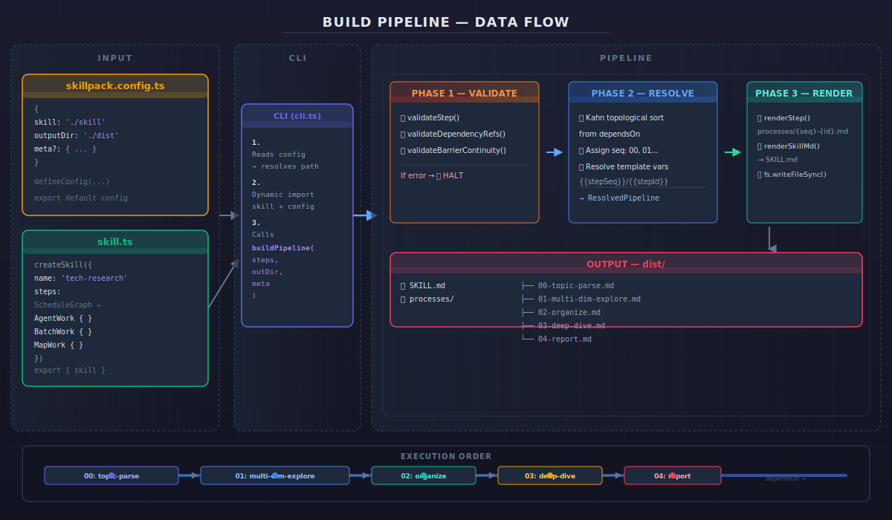

<!--
  _class: lead
-->

# skillpack monorepo 完全教学

从框架入口到构建输出，看懂整条链路的每一步。

---

<!--
  _class: section
-->

# ① 总览

---

# 项目鸟瞰

```
monorepo-dev/
├── packages/            ← 框架代码（4 个包，validate 可选，后续将合并入 build）
│   ├── skillpack-types/     类型 + 纯函数
│   ├── skillpack-common/    校验 + 拓扑排序
│   ├── skillpack-build/     构建器 + CLI 入口
│   └── skillpack-validate/  独立校验 CLI
├── demos/               ← 示例（使用者视角）
│   ├── skillpack.config.ts   配置
│   └── skill.ts              Skill 定义
├── dist/                ← 构建产物（gitignored）
└── docs/                ← 文档 + 图解
```

> **记住**：框架在 `packages/`，示例在 `demos/`，产物在 `dist/`。改代码永远在前两个目录。



---

# 包依赖 — 四个库谁依赖谁？

依赖是**单向**的，不能反向：

```text
skillpack-types  →  skillpack-common  →  skillpack-build
                                      →  skillpack-validate
```

<div class="columns">
  <div><strong>📐 types</strong><span>纯类型 + 纯函数，零依赖</span></div>
  <div><strong>⚙️ common</strong><span>依赖 types，实现校验 + 拓扑排序</span></div>
  <div><strong>🏗 build</strong><span>依赖 types + common，构建器 + CLI</span></div>
  <div><strong>🔍 validate</strong><span>依赖 types + common，独立校验 CLI（可选，后续合并入 build）</span></div>
</div>

构造顺序由 `tsc -b` 保证：types → common → {build, validate}（并行）



---

<!--
  _class: section
-->

# ② 入口：怎么定义一个 Skill？

---

# 配置 + CLI — 从文件到命令行

用户只写两个文件：

```typescript
// skillpack.config.ts
export default defineConfig({
  skill: './skill.ts',     // 指向 Skill 定义
  outputDir: '../dist',    // 输出目录
});
```

然后一行命令触发全流程：

```bash
tsx packages/skillpack-build/src/bin/cli.ts build skillpack.config.ts
```

> **类比**：`createSkill` 就像 Vue 的 `createApp`，`defineConfig` 就像 Vite 的 `defineConfig`。

---

# CLI 内部做了 5 件事

```text
① 解析 CLI 参数 → ② 读取 config → ③ import skill.ts
→ ④ 合并 meta → ⑤ 调用 buildPipeline()
                                    ↓
                         校验 → 拓扑排序 → 渲染 → 写文件
```



---

<!--
  _class: section
-->

# ③ 定义：createSkill

---

# createSkill — 入口

整个 skill 的定义入口，只 export 一个东西：

```typescript
export const skill = createSkill({
  name: 'tech-research',
  title: '前端技术调研',
  description: '针对一个前端技术主题...',
  steps: [
    stepParse,      // 主题解析（单 Task）
    stepExplore,    // 多维度探索（Parallel + 收敛 + 门禁）
    stepOrganize,   // 分类整理（两个 Task 顺序执行）
    stepDeepDive,   // 深度研究（两个 Task 串行）
    stepReport,     // 报告生成（MapNode）
  ],
});
```

> **记住**：steps 数组里的顺序不重要——真正的顺序由 `dependsOn` 字段决定，构建时用 Kahn 算法排序。

---

# createSkill 的结构


<div class="columns">
  <div><strong>📦 createSkill wrapper</strong><span>纯类型辅助，零运行时开销</span></div>
  <div><strong>📋 steps 数组</strong><span>StepDefinition 对象数组，顺序由 dependsOn 决定</span></div>
</div>

---

<!--
  _class: section
-->

# ④ StepDefinition — 步骤蓝图

---

# StepDefinition 核心字段

每个 StepDefinition 像一张"设计图纸"：

```typescript
const stepDeepDive: StepDefinition = {
  id:          'deep-dive',          // 唯一标识，kebab-case
  title:       '深度研究',            // 人类可读标题
  description: '核心概念研究 → 实践模式研究',
  dependsOn:   ['organize'],         // 前置步骤 id
  graph: seq('deep-dive-seq', '深度研究', [
      task({ id: 'concepts', type: 'agent', body: '...' }),
      task({ id: 'patterns', type: 'agent', body: '...' }),
  ]),    // 控制流树（递归节点，替代 v1 的扁平图+边）
  writes:      [{ path: '{workDir}/.meta/dive-concepts.json' }],
};
```

> **核心规则**：`id` + `dependsOn` + `graph` + `writes` 是必需的，其余按需使用。

---

# 可选字段：reads / barrier / reuse / degrade

| 字段 | 用途 |
|------|------|
| `reads` | 步骤需要读取哪些文件（可标记 `required: true`） |
| `barrier` | 检查点——执行到这步会暂停，让用户确认 |
| `reuse` | 增量复用——如果文件已存在，跳过这步 |
| `degrade` | 降级协议——失败后重试或降级处理 |
| `plugins` | 条件性加载的插件 |

```typescript
degrade: { maxRetries: 2, onDegrade: 'continue' },
barrier: { checkItems: ['核心概念发现数', ...] },
reuse:   [{ checkFile: '{workDir}/.meta/dive-concepts.json' }],
```

---

<!--
  _class: section
-->

# ⑤ 控制流树 — ControlNode

---

# 控制流树 — 取代扁平图+边

v2 用一棵**递归树**表达步骤内部的工作流。没有扁平节点列表，没有边，没有 entry：

```typescript
// v1（扁平图）
schedule: {
  entry: 'dive-concepts',
  nodes: [{ kind: 'agent', id: 'dive-concepts', ... }],
  edges: [{ from: 'dive-concepts', to: 'dive-patterns' }],
}

// v2（递归树）
graph: seq('deep-dive-seq', '深度研究', [
  task({ id: 'dive-concepts', type: 'agent', ... }),
  task({ id: 'dive-patterns', type: 'agent', ... }),
])
```

> **核心变化**：`seq()` 隐式表达了顺序，无需再写 `edges` + `entry`。

---

# 六种节点类型

每个节点都有一个 `kind` 属性，构成递归树：

| 节点 | 工厂函数 | 含义 |
|------|----------|------|
| `task` | `task()` | 原子任务——Agent / Script / Human / Subflow |
| `seq` | `seq()` | 顺序执行——子节点依次运行 |
| `parallel` | `parallel()` | 并行分支——子节点并发执行，可选收敛 + 门禁 |
| `map` | `mapNode()` | 滚动窗口——从数据源取条目，逐条 worker 处理 |
| `branch` | `branch()` | 条件分支——满足条件走 then，否则走 else |
| `loop` | `loop()` | 循环——重复执行 body 直到条件满足 |

---

# 树形结构示例

```typescript
parallel('research', '研究流程', [
  seq('explore', '探索阶段', [
    task({ id: 'parse',    type: 'agent', ... }),
    task({ id: 'search',   type: 'agent', ... }),
  ]),
  branch('check', '质量检查', 'pass >= 80%',
    task({ id: 'publish', type: 'agent', ... }),
    task({ id: 'retry',   type: 'agent', ... }),
  ),
])
```

> **类比**：就像 JSON 的嵌套结构——每个节点可以包含子节点，形成一棵树。

---

<!--
  _class: section
-->

# ⑥ Task — 原子任务节点

---

# Task — 最基础的构建块

Step 00 的例子——一个独立的原子任务：

```typescript
graph: task({
  id: 'parse',
  label: '主题解析',
  type: 'agent',
  body: `你是调研框架构建者。分析用户输入，提取 topic 和 tech_stack...`,
})
```

> **适用场景**：只需要给 LLM 一个独立任务，没有并行/串联需求。
>
> **注意**：`task()` 返回 `{ kind: 'task', task: TaskDef }`，`type` 可填 `agent`、`script`、`human`、`subflow`。

---

<!--
  _class: section
-->

# ⑦ Parallel — 并行分支

---

# Parallel — 并行 fan-out

Step 01 的例子——3 个 Task 同时跑：

```typescript
graph: parallel('explore-batch', '多维度并行探索', [
  task({ id: 'explore-docs',      type: 'agent', body: '你是文档分析师...' }),
  task({ id: 'explore-practice',  type: 'agent', body: '你是实践分析师...' }),
  task({ id: 'explore-ecosystem', type: 'agent', body: '你是生态分析师...' }),
])
```

> **效果**：3 个 Agent 互不依赖，完全并行。`parallel()` 自动管理并发，不需要显式 edges。

---

# Parallel — 收敛（Converge）

所有分支完成后，用一个 TaskDef 合并结果：

```typescript
parallel('explore-batch', '多维度并行探索', [...], {
  converge: {
    id: 'explore-converge',
    label: 'explore-integrator',
    type: 'agent',
    body: '合并三个维度的输出...',
  },
})
```

> **注意**：`converge` 是 `TaskDef` 对象，不是 `task()` 调用——`task()` 返回的是 `TaskNode`（带 `{ kind: 'task' }` 包装）。

---

# Parallel — 门禁（Gate）

质量门禁：满足条件才放行

```typescript
parallel('explore-batch', '多维度并行探索', [...], {
  converge: { id: 'explore-converge', type: 'agent', ... },
  gate: {
    rule: '3 agents completed or at most 1 degraded',
    onPass: 'converge',     // 通过 → 启动收敛
    onFail: 'degrade',      // 不通过 → 降级
  },
})
```

> **关键点**：`gate` 是可选守卫——控制"什么质量水平才能继续"。

---

<!--
  _class: section
-->

# ⑧ Map — 滚动窗口

---

# Map — 数据驱动批量处理

Step 04 的例子——对数据源的每条目执行同一个 worker：

```typescript
graph: mapNode(
  'report-map',
  '章节报告生成',
  '{workDir}/.meta/organized.json#categories',  // 数据源
  task({ id: 'report-worker', type: 'agent', body: '撰写报告章节...' }),
  3,  // 最大并发槽位
  { id: 'reduce-step', type: 'agent', label: 'Reduce Report',
    body: 'Combine all chapter reports into a final document' },  // 可选 reduce
)
```

> **工作原理**：从 `organized.json` 里取出 `categories` 数组，对每个 category 启动一个 Agent，最多 3 个同时跑。可选的 `reduce` 参数在所有 worker 完成后执行。

---

# Map vs Parallel 对比

| 维度 | Parallel | Map |
|------|----------|-----|
| 分支数 | 固定，手动列出 | 动态，由数据源决定 |
| 子结构 | 每个分支可以不同 | 所有条目共用同一 worker |
| 典型场景 | 多维度调研 | 批量报告生成 |

---

<!--
  _class: section
-->

# ⑨ 六种节点组合模式

---

# 常见组合模式

| 模式 | 组成 | 适用场景 |
|------|------|----------|
| **原子任务** | `task()` | 单个独立任务 |
| **顺序执行** | `seq()` 包裹多个 `task()` | 前后有依赖的多个步骤 |
| **并行 fan-out** | `parallel()` + 收敛 | 多维度调研后汇总 |
| **带门禁并行** | `parallel()` + converge + gate | 需要质量把关的并行任务 |
| **滚动窗口** | `mapNode()` | 数据驱动批量处理 |
| **条件分支** | `branch()` | 根据条件走不同路径 |
| **循环** | `loop()` | 反复执行直到条件满足 |

> **建议**：用树形嵌套组合节点——`seq(parallel([...]), task(...), branch(...))`。不需要再考虑扁平边和 entry。

---

<!--
  _class: section
-->

# ⑩ 条件·循环·生命周期钩子

---

# Branch — 条件分支

v2 用 `branch()` 表达条件逻辑，替代了 v1 的条件边：

```typescript
graph: branch('quality', '质量检查', 'pass >= 80%',
  task({ id: 'continue', type: 'agent', body: '发布报告...' }),
  task({ id: 'retry',    type: 'agent', body: '修正并重试...' }),
)
```

> **效果**：根据运行时的结果判断走 then 还是 else——真正的 `if/else` 语义。

---

# Loop — 循环

`loop()` 用于反复执行直到条件满足：

```typescript
graph: loop('review-loop', '审校循环', 'all issues resolved',
  task({ id: 'review', type: 'agent', body: '检查并修复问题...' }),
  5,  // 最大迭代次数
)
```

> **注意**：`maxIterations` 是安全阀，防止无限循环。

---

# 生命周期钩子

四种机制控制步骤执行行为：

<div class="columns">
  <div><strong>🚧 Barrier</strong><span>检查点。执行到这里暂停，向用户展示结果并等待确认。适合需要人工介入的关键步骤。</span></div>
  <div><strong>♻️ Reuse</strong><span>增量复用。检查文件是否已存在，存在则跳过整个步骤。</span></div>
  <div><strong>📉 Degrade</strong><span>降级协议。失败后重试（maxRetries），或标记降级继续（onDegrade）。</span></div>
  <div><strong>📌 CheckpointDef</strong><span>统一检查点（Phase 3 新增）。融合 file-exists、step-status、llm-judge、user-confirm 四种模式。</span></div>
</div>

---

<!--
  _class: section
-->

# ⑪ 构建流水线 — 三阶段

---

# Phase 1 — 校验（Validate）

三步检查，任何一步出错就停止：

```text
① validateStep(step)
   检查每个步骤字段是否完整
   - id / title / description 非空
   - graph 非空且为合法 ControlNode
   - writes 非空
   - barrier 有 clarifyPrompt

② validateDependencyRefs(steps)
   检查 dependsOn 指向的 step id 是否真实存在

③ validateBarrierContinuity(steps)
   检查 barrier 连续性——最后一个 barrier 之前必须都有 barrier
```

---

# Phase 2 — 拓扑排序（Resolve）

核心算法：**Kahn 算法**

```text
① 找到所有"没有前置依赖"的步骤（入度为 0）→ 排在最前面
② 它们排完后，检查哪些步骤的依赖已全部排完 → 再排它们
③ 重复直到所有步骤排完
④ 如果还有步骤没排但已经没有入度为 0 的了 → 循环依赖错误
```

排序完为每个步骤分配 `seq` 编号（00, 01, 02...）：

```text
00: topic-parse        // 无依赖 → 最先
01: multi-dim-explore  // 依赖 topic-parse
02: organize           // 依赖 multi-dim-explore
03: deep-dive          // 依赖 organize
04: report             // 依赖 deep-dive → 最后
```

---

# Phase 3 — 渲染（Render）

每个步骤 → Markdown 文件：

```text
renderStep(step)
  └─ renderControlTree(step.graph, 0)  // 递归遍历 ControlNode 树
      ├─ kind === 'task'     → Task 渲染
      ├─ kind === 'seq'      → 顺序块渲染
      ├─ kind === 'parallel' → 并行块渲染
      ├─ kind === 'map'      → Map 渲染
      ├─ kind === 'branch'   → 分支渲染
      └─ kind === 'loop'     → 循环渲染
  └─ 写入 dist/processes/{seq}-{id}.md

renderSkillMd(pipeline, meta)
  └─ 生成 dist/SKILL.md
```

> **产出**：每个步骤一个 Markdown 文件 + 一个总览 SKILL.md。

---

<!--
  _class: section
-->

# ⑫ 开发循环

---

# 三种开发场景

| 场景 | 命令 | 反馈速度 |
|------|------|----------|
| **A — 改框架代码** | `npm run build` → `npm run demo` | 慢（需编译框架包） |
| **B — 改 Skill 定义** | `npm run demo` | 最快（零构建，tsx 直接加载） |
| **C — 全量重建** | `npm run clean` → `npm run build` → `npm run demo` | 最慢（从头编译） |

> **日常最常用的是 Loop B**：改 `demos/skill.ts` → `npm run demo`，秒级反馈。

---

# 命令速查

| 命令 | 实际执行 | 什么时候用 |
|------|----------|-----------|
| `npm run build` | `tsc -b` | 改完 `packages/*/src/` 后 |
| `npm run demo` | tsx CLI → buildPipeline → dist/ | 查看构建结果 |
| `npm run typecheck` | `tsc -b --noEmit` | 快速检查类型错误 |
| `npm run clean` | rm -rf packages/*/dist dist | 重建前清理 |


---

<!--
  _class: lead
-->

# 你学会了什么

1. **项目结构** — packages / demos / dist 三层
2. **定义 Skill** — createSkill → StepDefinition
3. **控制流树** — Task / Seq / Parallel / Map / Branch / Loop 六种节点
4. **构建流水线** — 校验 → 排序 → 渲染
5. **开发循环** — 三种场景对应不同命令

下一步：打开 `demos/skill.ts`，看看实际的 5 个步骤是怎么写的。
