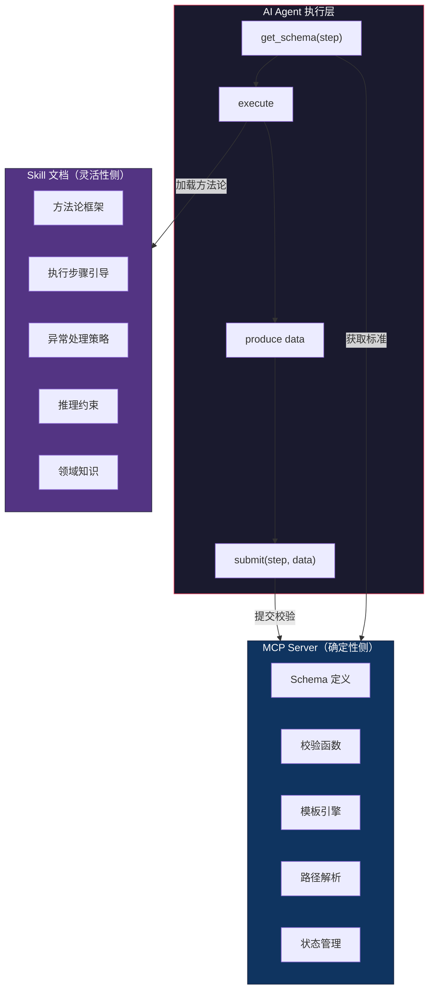
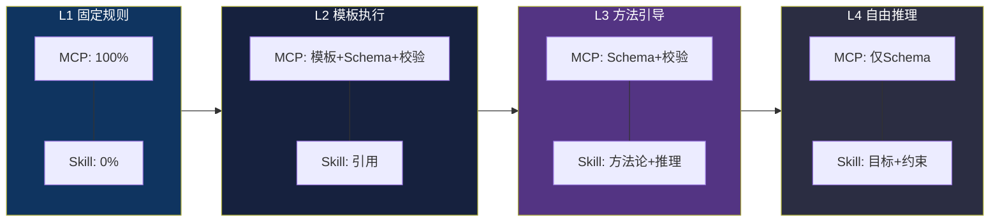
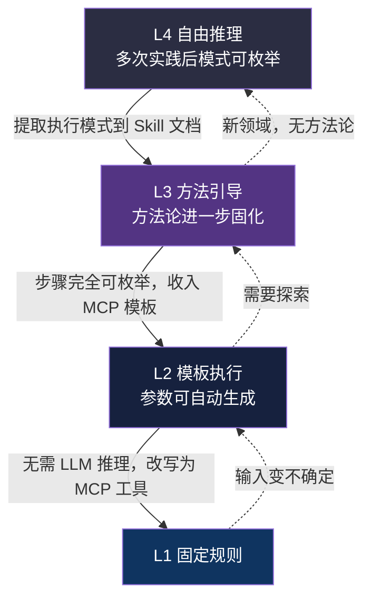
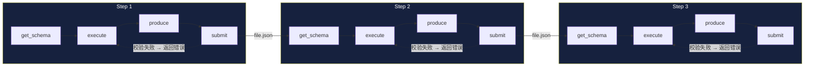

# MCP × Skill 双侧架构：AI Agent 管道化执行的四层边界模型

> 一种将确定性保证与推理灵活性统一在同一执行框架中的系统工程方法。
>
> 适用场景：需要 AI Agent 执行多步骤管道（pipeline）的任务——知识管线、文档生成、数据分析、代码审查等。

---

## 核心问题

AI Agent 执行多步骤管道时，面临一个根本矛盾：

```
确定性（不能错）  ←──张力──→  推理灵活性（可以探索）
```

- 太多确定性 → Agent 变成脚本执行器，失去推理优势
- 太多灵活性 → 产出格式不可控，下游步骤崩溃
- 没有标准 → 每个 Agent 自由发挥，产出不一致

现有方案要么偏向一端（纯模板 or 纯自由），要么在两者间做 ad-hoc 切换。

**我们的方案：不在这条光谱上选点，而是把光谱本身变成可配置的。**

---

## 架构全景



**MCP**（Model Context Protocol）提供工具和模板，保证产出质量和格式一致性。

**Skill 文档**提供方法论和推理引导，激发 Agent 的推理能力。

**四级模型**定义两者之间的边界在每个步骤中如何放置。

---

## 四级边界模型

不是四个独立的层，而是**同一条边界在不同位置的切面**：



### 判定规则

```
Q1: 输入确定后，输出是否完全确定？
  YES → L1（边界在最左，纯 MCP）

Q2: 执行步骤是否可预先枚举？
  YES → L2（边界偏左，MCP 模板主导）

Q3: 是否存在可复用的方法论？
  YES → L3（边界在中间，MCP + Skill 协作）
  NO  → L4（边界偏右，Skill 主导）
```

### 各级的 MCP/Skill 职责分配

| 级别 | MCP 侧 | Skill 侧 | 典型实例 |
|------|---------|----------|---------|
| **L1** | 输入校验 + 确定性输出 | 不参与 | 路径解析、状态保存、配置查询 |
| **L2** | 模板 + Schema + 校验 | 仅引用模板 | 结构化报告生成、数据组装 |
| **L3** | Schema + 校验 | 方法论 + 推理引导 | 问题分解、能力评估、策略识别 |
| **L4** | 仅 Schema | 目标描述 + 约束 | 广域扫描、探索性研究 |

---

## Schema 驱动范式

四级模型的统一落地方法论——所有级别共享同一条链路：

```
get_schema(step)  ──→  execute  ──→  submit(step, data)
获取标准              执行任务        提交校验
```

区别仅在于 `get_schema` 返回多少内容：

```
L1: 无 schema（纯函数契约）
L2: 执行指令 + 输出 schema + 校验规则
L3: 输出 schema + 校验规则（不含执行指令）
L4: 仅输出 schema
```

### 三件套模型

```
┌──────────────────────────────────────────────────────┐
│                    MCP Server                        │
│                                                      │
│  get_template(step)        → 执行指令 + 数据上下文   │
│  get_output_schema(step)   → 输出 schema + 规则      │
│  submit_output(step, data) → 校验 + 写入             │
│                                                      │
│  get_template: "怎么做"                              │
│  get_output_schema: "产出什么格式"                    │
│  submit_output: "保证符合标准"                        │
└──────────────────────────────────────────────────────┘
```

### 为什么 schema 在 MCP 侧而不是 Skill 侧？

```
如果 schema 在 Skill 侧：
  Agent A 读 skill → 理解格式 → 产出 JSON
  Agent B 读 skill → 理解格式 → 产出 JSON
  Agent A 和 B 的 JSON 格式可能不一致 ❌

如果 schema 在 MCP 侧：
  Agent A 调 get_output_schema → 拿到标准 → 产出 JSON → 调 submit_output → 校验
  Agent B 调 get_output_schema → 拿到标准 → 产出 JSON → 调 submit_output → 校验
  格式一定一致 ✅
```

Schema 是**跨 Agent 的契约**，必须在 MCP 侧集中管理。

---

## 边界移动策略

### 演进方向：L4 → L3 → L2 → L1



### 退化方向：L1 → L2 → L3 → L4

当输入变得不确定、环境变化、或需要探索时，边界反向移动。

**关键洞察**：边界不是静态的，而是随任务复杂度和实践成熟度动态调整的。

---

## 信息流完整性

管道中的每个步骤都是一个 `get → execute → submit` 循环：



**步骤间通过文件交接，不通过上下文传递。** 每个步骤的输入是上游的结构化文件，不是上游的执行痕迹。

这保证了：
- 每步可独立审计（有文件持久化）
- 单步失败可从断点恢复（文件就是 checkpoint）
- 子 Agent 可并行执行（输入文件确定后互不依赖）

---

## MCP 与 Skill 的协作范式

### 不是替代关系，而是互补关系

```
常见误区：
  "有了 MCP 模板，Skill 文档就没用了"     ❌
  "有了 Skill 方法论，MCP 就多余了"       ❌

正确理解：
  MCP 保证"不能错"的部分
  Skill 管理"可以探索"的部分
  两者共同构成完整的执行框架
```

### Skill 文档的价值不在格式，在认知

MCP Schema 管住了格式，Skill 文档的价值就集中在：
- **方法论框架**：为什么这样分解问题？评估维度的权重依据是什么？
- **推理约束**：哪些路径明显错误？搜索空间如何剪枝？
- **领域知识**：这个技术栈的最佳实践是什么？常见的坑在哪？

这些是 MCP 无法替代的——它们需要推理，而推理是 Agent 的核心价值。

---

## 实际效果

以一个知识管线（技术面试研究）为例：

| 指标 | 改造前 | 改造后 |
|------|--------|--------|
| 产出格式一致性 | ~60%（Agent 自由发挥） | ~98%（Schema 校验） |
| 步骤间信息流断裂 | 3 处 | 0 处（文件交接 + Schema 契约） |
| 产出可审计性 | 无（只在上下文中） | 完整（文件 + 日志） |
| 单步失败恢复 | 从头重来 | 从断点继续 |
| Agent 推理空间 | 完全自由 | 方法论约束下自由 |

---

## 适用范围

本架构不限于特定领域。任何满足以下条件的场景都可应用：

1. **多步骤管道**：步骤间有数据依赖
2. **需要质量保证**：产出格式必须一致
3. **需要推理灵活性**：不能完全模板化
4. **多 Agent 可能**：不同 Agent 可能执行同一管道

典型场景：
- 知识管线（研究 → 分析 → 组装 → 报告）
- 文档生成（收集 → 结构化 → 校验 → 输出）
- 代码审查（扫描 → 分析 → 评估 → 建议）
- 数据分析（采集 → 清洗 → 分析 → 可视化）

---

## 附：技术实现参考

本架构在 [scenario-pipeline-skill](https://github.com/...) 项目中完整实现。

核心组件：
- `mcp-server/src/schemas/` — Schema 注册表（6 个步骤的输出 schema）
- `mcp-server/src/validators/` — 通用校验框架
- `mcp-server/src/domains/output/` — get_output_schema + submit_output 工具
- `pipeline/architecture-model.md` — 项目级四级模型定义
